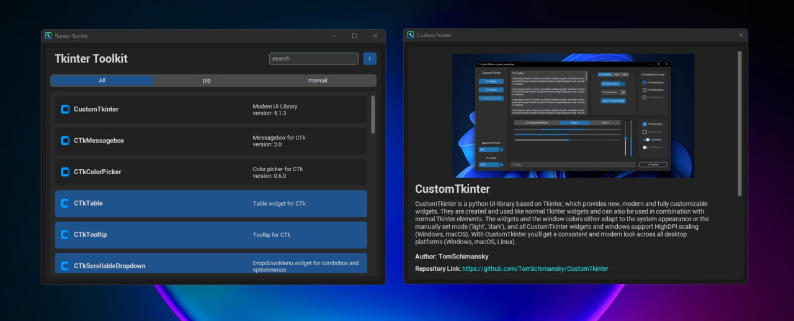
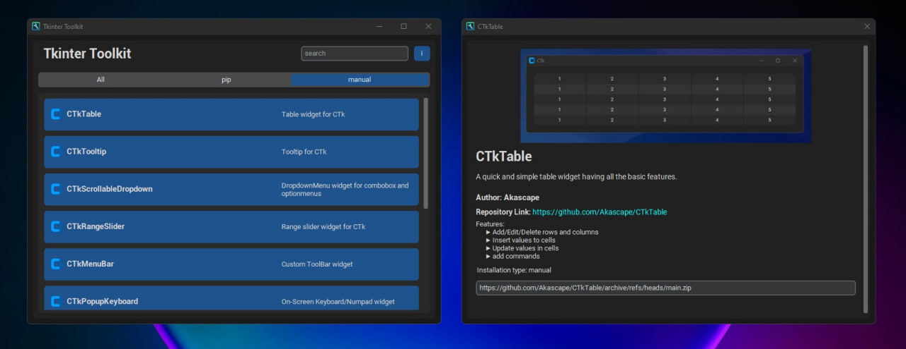
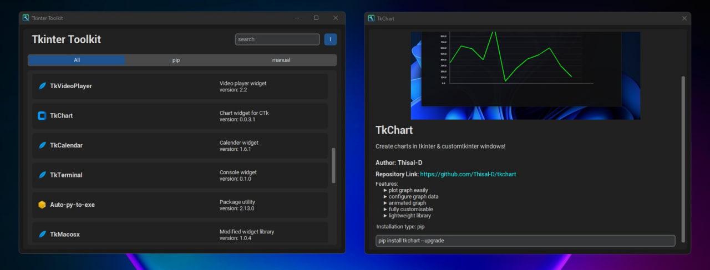

# TKINTER TOOLKIT
👨‍🏫APLICAÇÃO COM CUSTOMTKINTER E JSON, QUE CONSOME A API DO GITHUB PARA OBTER INFORMAÇÕES ADICIONAIS SOBRE OS PACOTES LISTADOS NO ARQUIVO JSON DE BANCO DE DADOS.

 <br>
 <br>
 <br>

## DESCRIÇÃO:
O projeto "Tkinter Toolkit" é uma aplicação desenvolvida em Python usando a biblioteca CustomTkinter, que oferece uma interface gráfica para encontrar e explorar pacotes relacionados ao Tkinter e CustomTkinter. Ele busca informações de um banco de dados JSON e exibe detalhes de cada pacote, como descrição, autor, links relevantes e estatísticas do GitHub (como número de estrelas). Os usuários podem filtrar pacotes por tipo (pip, manual) e pesquisar por tags relacionadas aos pacotes.

## FUNCIONALIDADES:
1. **Interface Gráfica Amigável:**
   - A aplicação utiliza CustomTkinter para uma interface gráfica atraente e responsiva.
   - Inclui botões, entradas de texto, e elementos gráficos personalizados.

2. **Pesquisa e Filtragem de Pacotes:**
   - Os usuários podem pesquisar pacotes pelo nome ou por tags relacionadas usando a caixa de pesquisa.
   - Filtragem por tipo de pacote (Todos, pip, manual) através de um botão de segmentação.

3. **Visualização de Detalhes de Pacote:**
   - Cada pacote listado exibe uma descrição, botão para instalação (com opção de atualização), e detalhes adicionais.
   - Ao clicar em um pacote, uma janela detalhada é aberta mostrando uma imagem (se disponível), detalhes completos, autor, link do repositório, estatísticas do GitHub e recursos destacados.

4. **Atualização de Banco de Dados:**
   - A funcionalidade "Update Database" permite atualizar o banco de dados local com novos pacotes e informações.

5. **Integração com GitHub:**
   - A aplicação verifica o número de estrelas de um pacote no GitHub, para fornecer uma ideia da popularidade do projeto.

## FUNCIONAMENTO DO CONSUMO DA API DO GITHUB:
O aplicativo consome a API do GitHub para obter informações adicionais sobre os pacotes listados no arquivo JSON de banco de dados (`./CODIGO/assets/database.json`). A seguir, explico como isso é implementado com base nos dados fornecidos:

1. **Objetivo:**
   - O aplicativo utiliza a API do GitHub para obter informações dinâmicas sobre os repositórios dos pacotes listados.

2. **Dados Necessários:**
   - Cada entrada no arquivo JSON (`database.json`) contém informações básicas sobre um pacote, como nome, descrição, autor, URL do repositório, URL da imagem, entre outros detalhes relevantes.

3. **Integração com a API do GitHub:**
   - Quando um usuário interage com um pacote na interface (por exemplo, clicando para abrir detalhes), o aplicativo consulta a API do GitHub para obter informações atualizadas, como o número de estrelas (indicador de popularidade) e o avatar do proprietário do repositório.

4. **Detalhes Técnicos:**
   - O método `get_stars_and_avatar(name)` é responsável por realizar a consulta à API do GitHub. Ele recebe o nome do pacote como parâmetro.
   - Utiliza a URL do repositório fornecida no JSON para construir a requisição à API do GitHub.
   - Extrai os dados relevantes da resposta JSON, como o número de estrelas (`stargazers_count`) e a URL do avatar do proprietário do repositório (`owner/avatar_url`).

5. **Atualizações Dinâmicas na Interface:**
   - As informações obtidas da API do GitHub são exibidas dinamicamente na interface do usuário quando disponíveis.
   - Isso inclui a exibição do número de estrelas ao lado do link do repositório e a exibição do avatar do proprietário do repositório.

### EXEMPLO DE IMPLEMENTAÇÃO:
Suponha que o aplicativo esteja exibindo informações para o pacote `CTkTable` com base nos dados fornecidos:

- **Nome do Pacote:** `CTkTable`
- **URL do Repositório:** `https://github.com/Akascape/CTkTable`

Ao abrir os detalhes deste pacote no aplicativo, o método `get_stars_and_avatar("CTkTable")` fará uma requisição à API do GitHub para obter informações como o número de estrelas e a URL do avatar do autor do repositório. Esses dados serão então exibidos na janela de detalhes do pacote, fornecendo uma visão mais completa e atualizada para o usuário.

Essa integração permite que o aplicativo ofereça uma experiência mais informativa e atualizada aos usuários, incorporando dados dinâmicos diretamente de uma fonte confiável como a API do GitHub.

## EXECUTANDO ESSE PROJETO:
1. **Pré-requisitos:**
   - Certifique-se de ter Python 3.7 ou superior instalado.
   - Instale as dependências necessárias utilizando o comando abaixo:
     ```bash
     pip install -r requirements.txt
     ```

2. **Execução do Aplicativo:**
   - Para executar o arquivo Python, utilize o comando abaixo no terminal, dentro do diretório `./CODIGO`:
   ```bash
   python CODIGO.py
   ```

3. **Interagindo com a Aplicação:**
   - Após iniciar, a janela principal do "Tkinter Toolkit" será exibida.
   - Use a caixa de pesquisa para procurar por pacotes digitando o nome ou tag relacionada.
   - Use o botão de segmentação para filtrar pacotes por tipo (Todos, pip, manual).
   - Clique no botão de informações (ícone "i") para abrir uma janela com informações sobre o aplicativo.

4. **Explorando Detalhes de Pacotes:**
   - Clique em qualquer pacote listado para abrir uma janela detalhada com informações completas, incluindo imagem, descrição, autor, link do repositório, estrelas do GitHub e recursos destacados.

5. **Atualizando o Banco de Dados:**
   - Dentro da janela de informações ("About"), clique em "Update Database" para verificar e baixar novos pacotes disponíveis no banco de dados.

6. **Finalizando o Aplicativo:**
   - Feche a janela principal para encerrar a execução do aplicativo.

## NÃO SABE?
- Entendemos que para manipular arquivos em muitas linguagens, é necessário possuir conhecimento nessas áreas. Para auxiliar nesse aprendizado, oferecemos cursos gratuitos disponíveis:
* [CURSO DE PYTHON](https://github.com/VILHALVA/CURSO-DE-PYTHON)
* [CURSO DE CUSTOMTKINTER](https://github.com/VILHALVA/CURSO-DE-CUSTOMTKINTER)
* [CURSO DE JSON](https://github.com/VILHALVA/CURSO-DE-JSON)
* [CONFIRA MAIS CURSOS](https://github.com/VILHALVA?tab=repositories&q=+topic:CURSO)

## CREDITOS:
- [PROJETO CRIADO PELO "AKASCAPE"](https://github.com/Akascape/tkinter-toolkit)
- [PROJETO EDITADO PELO VILHALVA](https://github.com/VILHALVA)


